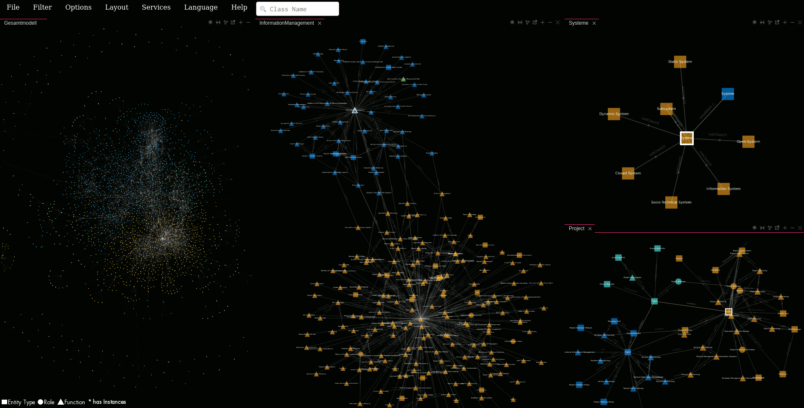
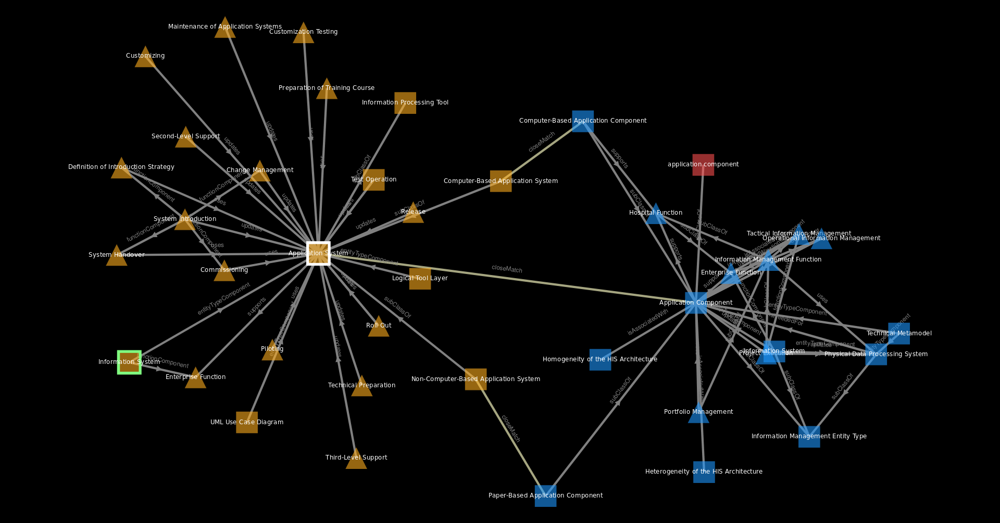

# Summary

**SNIK Graph** is a web-based interactive Linked Data graph visualization that is optimized for teaching and studying knowledge about the management of health information systems.
This knowledge is provided by SNIK [@sniktec], the semantic network of information management in hospitals, which combines the knowledge of three textbooks [@bb; @ob; @he], the IT4IT standard and an interview with a hospital CIO.
An installation containing SNIK is published at <https://www.snik.eu/graph> as well as <https://snikproject.github.io/snik-graph>, but other ontologies and knowledge bases can be used as well.

The meta model of SNIK classifies each resource as being either a role, function or entity type, see \autoref{fig:metamodel}.
Due to the large amount of resources, visualizing SNIK as a graph causes overplotting as shown in \autoref{fig:completegraph}.
To alleviate this, SNIK offers multiple exploration methods described in the following.

{ width=83% }

A frequent question is, what a given role does and which information is needed for those functions represented by the entity types connected to those functions.
This question is visually answered by the *role use* feature, which arranges roles, functions and entity types in concentric circles.

Exploration using neighbours, that is the successive uncovering of nodes adjacent to a starting node given by a user, is a common feature of tools such as LodLive [@lodlive] and VizLOD [@vizlod].
The directed and undirected *star* operations show nodes in the direct neighbourhood of selected nodes.
The *circle star* also rearranges the nodes using the force-directed layout locally on the currently visible subgraph.
\autoref{fig:star} shows a mind map of of a topic, created by an undirected star, which can be used by a teacher to prepare a lecture about that topic.

A *spiderworm* is a path from node A to node B combined with a *star* of B.
\autoref{fig:spiderworm} shows how we use a spiderworm to teach a student how the new concept "quality of data" is connected the the already introduced concept "patient identification number."

{ width=100% }

# Statement of need
Medical and health informatics integrates knowledge of business information systems, computer science and medicine.
As a comparatively young research discipline, it lacks a uniform terminology, especially for describing health information systems and their management.
Several textbooks provide different perspectives of the discipline but the linear struture inherent in a book does not intuitively convey the highly connected nature of the concepts of the domain.
SNIK, the semantic network of information management in hospitals, combines the knowledge of three textbooks [@bb; @ob; @he], the IT4IT standard and an interview with a hospital CIO.
Our main goal is to visualize knowledge extracted from text books to users that may not have any Semantic Web experience.

Graph-based visualizations allow teachers to intuitively convey relationships between a selection of those concepts and also allow students to explore the domain on their own [@ontologybased].
There are several existing graph-based Linked Data visualizations [@linkeddatavisualization], which visualize RDF resources (classes or instanes) as nodes and their relationships as edges, but they do not fit our requirements [@visualizationoflargeontologies].
With the thousands of classes of SNIK, graph-based visualization suffers from overplotting.
Thus, SNIK Graph offers several options to select and layout subgraphs, for example to show only a specific chapter of a book to prepare a lecture about a specific topic.
Users can also iteratively explore SNIK starting at a single class using neighbourhood and path operations.

## Future work
The single-thread paradigm of JavaScript seriously hinders performance of CPU-bound applications like SNIK Graph on the more than 4000 resources of SNIK.
While SNIK Graph does not require perfectly smooth motion and wild movements are not a common usage pattern, stuttering is still frustrating to users especially on less performant CPUs and browsers other than Chrome and contrary to our goal of minimizing friction for users. 
Implementing an OpenGL-based renderer for Cytoscape.js has the potential to dramatically increase render speed.

The search index is implemented using the Fuse.js [@fuse] client-side library based on the Baeza-Yates--Gonnet algorithm [@textsearching].
This enables fuzzy search on any dataset loaded via SPARQL endpoint without needing a backend search index like Elasticsearch but requires waiting for index initialization on the first search of each user session and is not fast enough for autocompletion, even with debouncing and throttling.

# Acknowledgements
This work is supported by the DFG (German Research Foundation) under the Project SNIK, Grant no. 1605/7-1 and 1387/8-1.

# References
% SNIK Graph is presented in poster form at \cite{snikgraphposter}.
